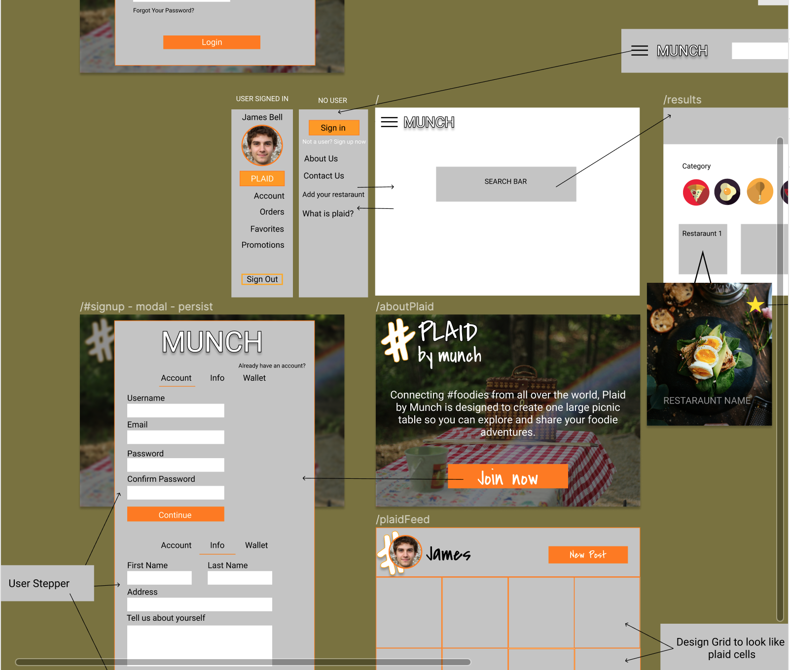
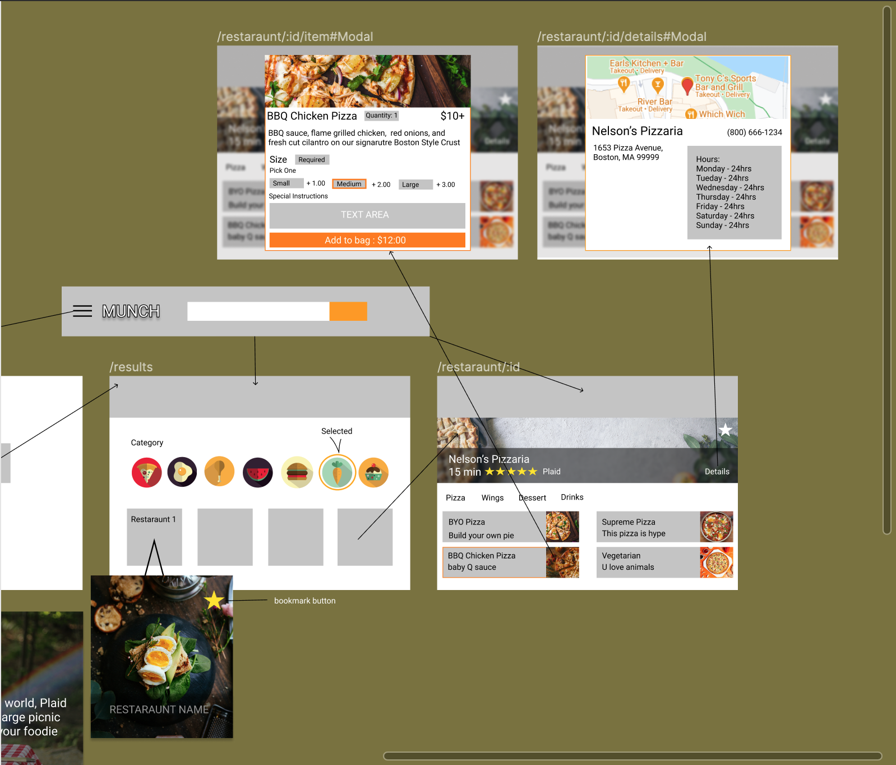
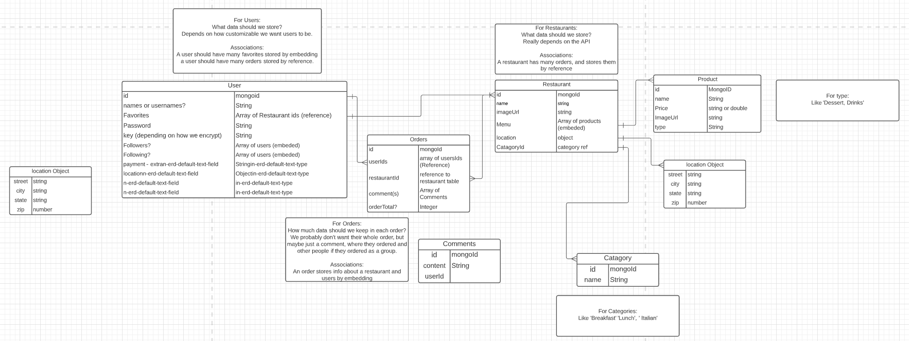

# Munch
Are you the busy professional on their hour lunch break? The cozy couple that doesn't want to leave their couch? Or the one that's too lazy to make dinner? Munch is for the empty stomaches and the restaurants that want to feed them.

## Munch's Goal
Munch creates a streamlined relationship between users and restaurants. Our website fulfills and delivers customer's orders on the website. After the customer finishes their delicious meal, they may want to thank the retaurant, or maybe share about their foodie experience. This is why Plaid by Munch was designed. 

## Plaid 
Connecting #foodies together, Plaid by Munch is designed to create one large picnic table so you can explore and share your foodie adventures. A social media twist on popular deliver apps, that also satiates that feeling of sharing your delicious meal to all your friends and plaid stitches. Users can comment and leave crumbs on reviews that they find the most useful.

## User Stories 
### Users - I want to
- [ ] Search my local area for retaurants
- [ ] Purchase menu items from retaurants
- [ ] Customize profile
- [ ] Post on the plaid social platform
- [ ] Comment on other user's plaid post
- [ ] Favorite a retaurant
- [ ] Follow other users
### retaurants - I want to 
- [ ] Post menu - w/ description and images
- [ ] Interact on the plaid social network 
- [ ] Connec with users and receive foodback on our food

## PostMan API Documentation
[Link Here!](https://documenter.getpostman.com/view/14742524/Tz5qbxeC)

## Wireframes 

 
## Team Goals
- [ ] Achieve MVP 
- [ ] Geo Location API
- [ ] Payment Method API 

## Credits
- Category Icons made by [Freepik](https://www.freepik.com) from [www.flaticon.com](https://www.flaticon.com/).
